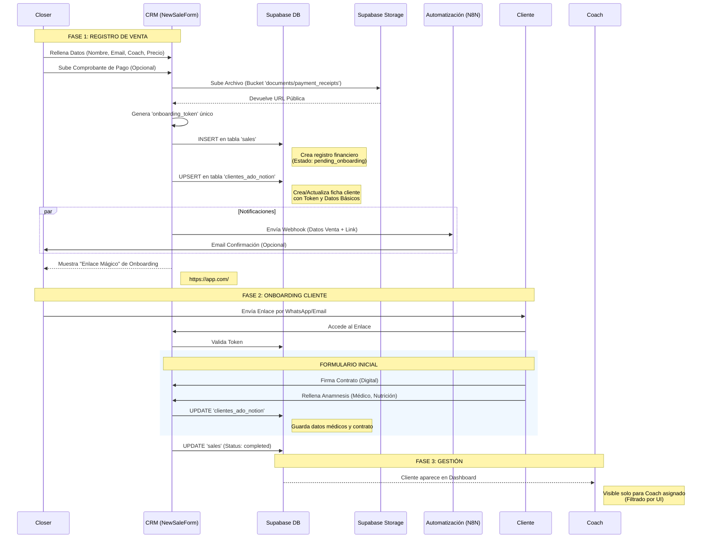

# 🔄 Diagrama de Flujo: Venta y Alta de Cliente

Este diagrama ilustra el proceso técnico y operativo desde que un Closer cierra una venta hasta que el cliente está activo en el CRM.

```mermaid
sequenceDiagram
    participant C as Closer
    participant UI as CRM (NewSaleForm)
    participant DB as Supabase DB
    participant S as Supabase Storage
    participant N8N as Automatización (N8N)
    participant CL as Cliente
    participant CO as Coach

    Note over C, UI: FASE 1: REGISTRO DE VENTA
    C->>UI: Rellena Datos (Nombre, Email, Coach, Precio)
    C->>UI: Sube Comprobante de Pago (Opcional)
    UI->>S: Sube Archivo (Bucket 'documents/payment_receipts')
    S-->>UI: Devuelve URL Pública

    UI->>UI: Genera 'onboarding_token' único
    
    UI->>DB: INSERT en tabla 'sales'
    Note right of DB: Crea registro financiero<br/>(Estado: pending_onboarding)

    UI->>DB: UPSERT en tabla 'clientes_ado_notion'
    Note right of DB: Crea/Actualiza ficha cliente<br/>con Token y Datos Básicos

    par Notificaciones
        UI->>N8N: Envía Webhook (Datos Venta + Link)
        N8N->>C: Email Confirmación (Opcional)
    end

    UI-->>C: Muestra "Enlace Mágico" de Onboarding
    Note right of UI: https://app.com/#/bienvenida/{token}

    Note over C, CL: FASE 2: ONBOARDING CLIENTE
    C->>CL: Envía Enlace por WhatsApp/Email
    CL->>UI: Accede al Enlace
    UI->>DB: Valida Token
    
    rect rgb(240, 248, 255)
        Note over CL, UI: FORMULARIO INICIAL
        CL->>UI: Firma Contrato (Digital)
        CL->>UI: Rellena Anamnesis (Médico, Nutrición)
        UI->>DB: UPDATE 'clientes_ado_notion'
        Note right of DB: Guarda datos médicos y contrato
    end

    UI->>DB: UPDATE 'sales' (Status: completed)
    
    Note over CO, DB: FASE 3: GESTIÓN
    DB-->>CO: Cliente aparece en Dashboard
    Note right of CO: Visible solo para Coach asignado<br/>(Filtrado por UI)
```
